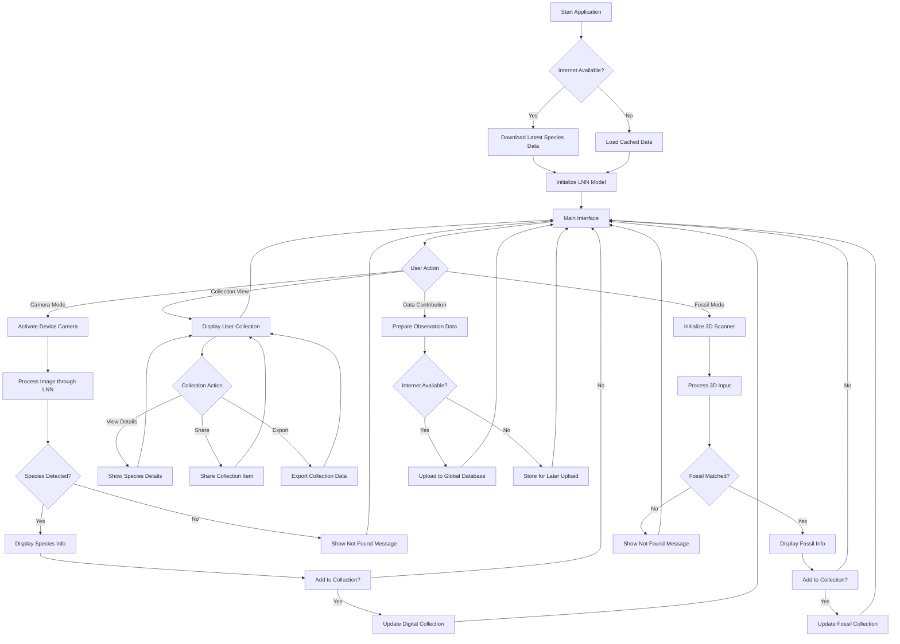
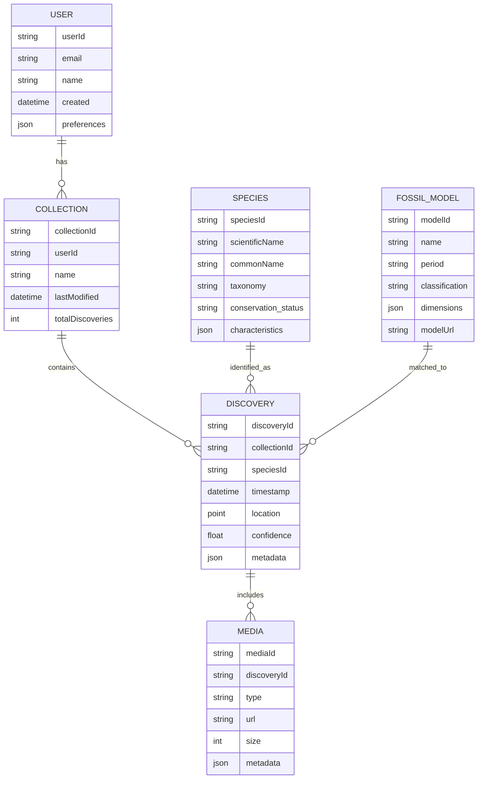
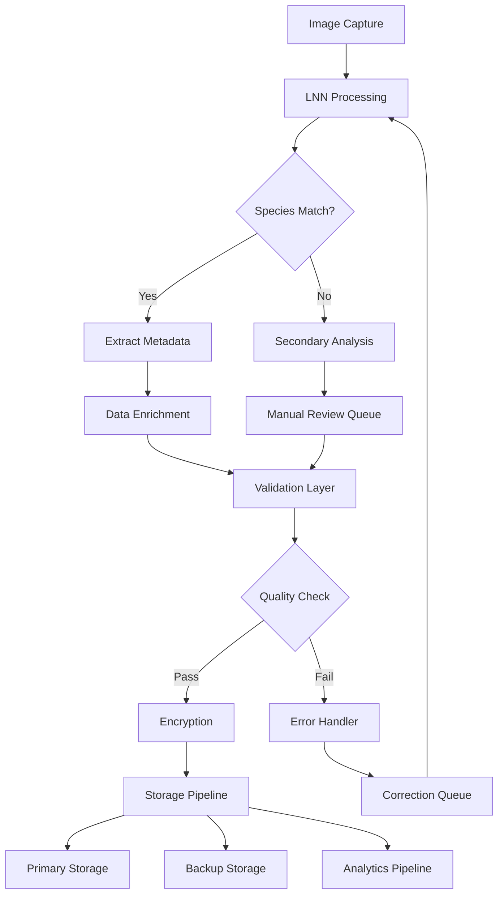
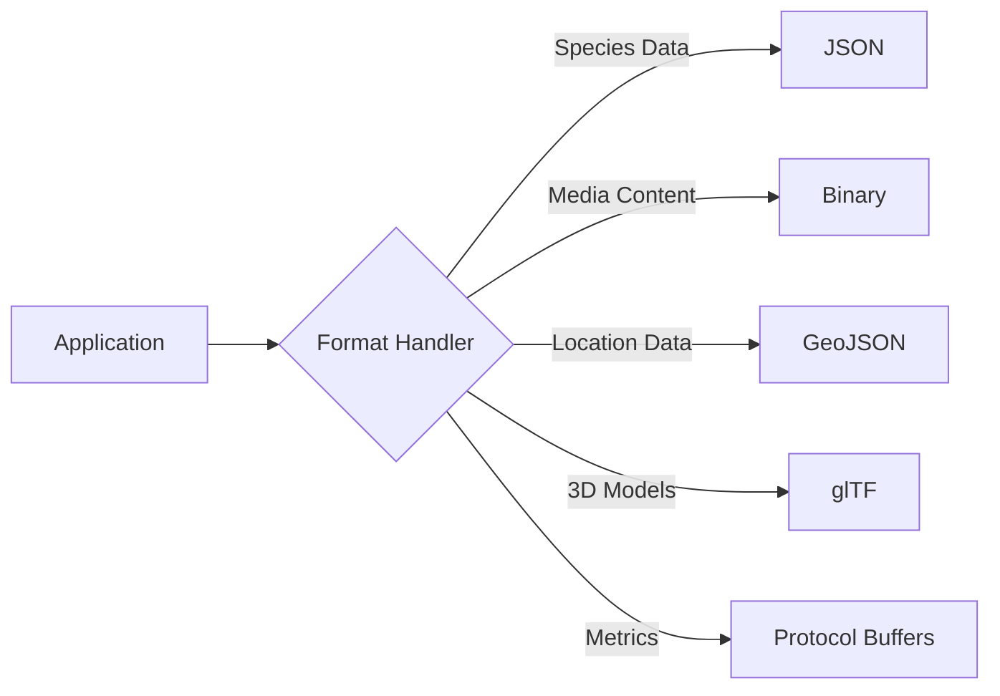

# Product Requirements Document (PRD)

# 1. INTRODUCTION

## 1.1 Purpose
This Product Requirements Document (PRD) outlines the comprehensive specifications and requirements for developing a wildlife detection safari Pokédex application. The document serves as a reference for project stakeholders, including:
- Development team members
- Project managers
- Quality assurance engineers
- UX/UI designers
- Machine learning engineers
- Wildlife experts and consultants

## 1.2 Scope
The wildlife detection safari Pokédex is a mobile application that utilizes Liquid Neural Networks (LNN) for real-time identification and classification of wildlife species and dinosaur fossils. The system will:

- Provide real-time identification of animals and plants using device cameras
- Offer 3D model recognition for dinosaur fossils and skeletons
- Create a digital collection of encountered species
- Support offline functionality for remote safari locations
- Integrate with multiple comprehensive datasets including iNaturalist, ImageNet, and DinoData
- Deliver educational content about identified species
- Enable user contributions to global biodiversity databases

Key benefits include:
- Enhanced wildlife education and awareness
- Contribution to citizen science initiatives
- Support for conservation efforts through data collection
- Gamification of nature exploration
- Accessibility to paleontological knowledge

The application will leverage advanced machine learning capabilities while maintaining user-friendly interfaces suitable for both casual users and professional researchers.

# 2. PRODUCT DESCRIPTION

## 2.1 Product Perspective
The wildlife detection safari Pokédex operates as a standalone mobile application while integrating with several external systems and databases:

- Device Hardware Integration
  - Camera systems for real-time image capture
  - GPS for location tracking
  - Local storage for offline functionality
  - Accelerometer and gyroscope for 3D model interaction

- External System Integration
  - iNaturalist API for species validation
  - GBIF database for biodiversity data
  - DinoData for fossil and skeleton reference
  - Cloud storage for user collections
  - Global wildlife tracking databases

## 2.2 Product Functions
- Real-time Wildlife Detection
  - Live camera feed analysis using LNN
  - Species identification and classification
  - Behavioral pattern recognition
  - Population counting and tracking

- Digital Collection Management
  - Personal species catalog
  - Achievement tracking
  - Progress statistics
  - Sharing capabilities

- Educational Features
  - Species information cards
  - Interactive 3D fossil models
  - Habitat and behavior data
  - Conservation status updates

- Data Contribution
  - Species sighting reports
  - Population tracking
  - Habitat mapping
  - Research data submission

## 2.3 User Characteristics
Primary User Personas:

1. Casual Nature Enthusiast
   - Basic wildlife knowledge
   - Recreational usage
   - Interest in collection features
   - Minimal technical expertise

2. Professional Researcher
   - Advanced scientific knowledge
   - Regular field work
   - Data collection focus
   - High technical proficiency

3. Educational Institution User
   - Teaching purpose usage
   - Group activity management
   - Moderate technical skills
   - Focus on learning features

4. Conservation Worker
   - Species monitoring focus
   - Regular field deployment
   - Data contribution priority
   - Moderate to high expertise

## 2.4 Constraints
Technical Constraints:
- Mobile device processing limitations
- Battery life considerations
- Offline storage capacity
- Network connectivity in remote areas
- Camera quality dependencies

Regulatory Constraints:
- Wildlife protection laws
- Data privacy regulations
- Research permits requirements
- Location-based restrictions
- Age-appropriate content guidelines

Resource Constraints:
- Development timeline: 18 months
- Budget limitations for dataset acquisition
- Server infrastructure capacity
- Available machine learning expertise

## 2.5 Assumptions and Dependencies
Assumptions:
- Users have smartphones with minimum required specifications
- Basic internet connectivity is available for initial setup
- Users can provide necessary permissions for device features
- Species databases remain maintained and accessible
- LNN technology continues to advance as expected

Dependencies:
- Access to iNaturalist API and dataset
- Availability of DinoData 3D models
- Continued support for machine learning frameworks
- Mobile platform SDK compatibility
- Third-party authentication services
- Cloud storage providers
- GPS satellite accessibility
- Camera API functionality

# 3. PROCESS FLOWCHART

# 4. FUNCTIONAL REQUIREMENTS

## 4.1 Real-time Wildlife Detection (F1)

### Description
Core feature enabling real-time identification of wildlife species through device camera using Liquid Neural Networks.

### Priority
Critical (P0)

### Requirements Table

| ID | Requirement | Priority |
|---|---|---|
| F1.1 | Process camera feed through LNN model at minimum 15 FPS | P0 |
| F1.2 | Identify species with 90% accuracy for clear images | P0 |
| F1.3 | Support offline species detection for top 1000 common species | P0 |
| F1.4 | Provide confidence score for each identification | P1 |
| F1.5 | Handle multiple species in single frame | P1 |
| F1.6 | Detect and track animal movement patterns | P2 |

## 4.2 Fossil Recognition System (F2)

### Description
3D scanning and recognition system for dinosaur fossils and skeletons using LNN technology.

### Priority
High (P1)

### Requirements Table

| ID | Requirement | Priority |
|---|---|---|
| F2.1 | Process 3D scans using device sensors | P1 |
| F2.2 | Match fossils against DinoData database | P1 |
| F2.3 | Generate 3D model overlays for identified specimens | P1 |
| F2.4 | Support offline recognition of major dinosaur species | P1 |
| F2.5 | Calculate size and scale estimations | P2 |
| F2.6 | Reconstruct complete skeleton from partial scans | P3 |

## 4.3 Digital Collection Management (F3)

### Description
System for organizing and managing user's discovered species and fossils.

### Priority
High (P1)

### Requirements Table

| ID | Requirement | Priority |
|---|---|---|
| F3.1 | Store discovered species with metadata | P1 |
| F3.2 | Sync collection with cloud when online | P1 |
| F3.3 | Generate achievement badges for milestones | P1 |
| F3.4 | Export collection data in standard formats | P2 |
| F3.5 | Share discoveries on social platforms | P2 |
| F3.6 | Track discovery statistics and trends | P2 |

## 4.4 Educational Content System (F4)

### Description
Educational information delivery system integrated with species identification.

### Priority
Medium (P2)

### Requirements Table

| ID | Requirement | Priority |
|---|---|---|
| F4.1 | Display species information cards | P2 |
| F4.2 | Provide interactive 3D models for learning | P2 |
| F4.3 | Include conservation status and threats | P2 |
| F4.4 | Offer quiz and learning modules | P2 |
| F4.5 | Support multiple languages | P3 |
| F4.6 | Generate customized learning paths | P3 |

## 4.5 Data Contribution System (F5)

### Description
Framework for users to contribute wildlife sightings to global databases.

### Priority
Medium (P2)

### Requirements Table

| ID | Requirement | Priority |
|---|---|---|
| F5.1 | Submit sightings to iNaturalist database | P2 |
| F5.2 | Queue submissions for offline use | P2 |
| F5.3 | Validate data quality before submission | P2 |
| F5.4 | Track contribution impact metrics | P2 |
| F5.5 | Support research-grade documentation | P3 |
| F5.6 | Enable collaborative verification | P3 |

## 4.6 Location Services (F6)

### Description
Location-based features for tracking and mapping wildlife encounters.

### Priority
Medium (P2)

### Requirements Table

| ID | Requirement | Priority |
|---|---|---|
| F6.1 | Track GPS coordinates of sightings | P2 |
| F6.2 | Generate species distribution maps | P2 |
| F6.3 | Support geofencing for rare species | P2 |
| F6.4 | Provide offline map functionality | P2 |
| F6.5 | Calculate migration patterns | P3 |
| F6.6 | Enable location-based alerts | P3 |

# 5. NON-FUNCTIONAL REQUIREMENTS

## 5.1 Performance Requirements

| ID | Requirement | Target Metric |
|---|---|---|
| P1.1 | LNN model inference time | ≤ 100ms per frame |
| P1.2 | Application launch time | ≤ 3 seconds |
| P1.3 | Camera feed processing | Minimum 15 FPS |
| P1.4 | Maximum memory usage | ≤ 500MB active, ≤ 1GB total |
| P1.5 | Battery consumption | ≤ 5% per hour of active use |
| P1.6 | Offline database size | ≤ 2GB for core species data |
| P1.7 | 3D model rendering time | ≤ 2 seconds per model |
| P1.8 | Cloud sync speed | ≤ 30 seconds for 100 entries |

## 5.2 Safety Requirements

| ID | Requirement | Description |
|---|---|---|
| S1.1 | Data backup | Automatic backup every 24 hours |
| S1.2 | Graceful degradation | Maintain core functions during resource constraints |
| S1.3 | Error recovery | Auto-recovery from crashes without data loss |
| S1.4 | Location safety | Warning system for dangerous wildlife areas |
| S1.5 | Hardware protection | Thermal monitoring for device protection |
| S1.6 | Data integrity | Checksums for all stored data |

## 5.3 Security Requirements

| ID | Requirement | Description |
|---|---|---|
| SE1.1 | User authentication | Multi-factor authentication support |
| SE1.2 | Data encryption | AES-256 encryption for stored data |
| SE1.3 | Secure transmission | TLS 1.3 for all network communications |
| SE1.4 | Privacy controls | Granular location sharing permissions |
| SE1.5 | Access management | Role-based access control system |
| SE1.6 | Audit logging | Track all system and data access events |
| SE1.7 | Sensitive data | Mask exact locations of endangered species |

## 5.4 Quality Requirements

### 5.4.1 Availability
- System uptime: 99.9% excluding planned maintenance
- Offline functionality: 100% for core features
- Maximum planned downtime: 4 hours per month

### 5.4.2 Maintainability
- Code documentation: 100% coverage
- Modular architecture with clear separation of concerns
- Automated testing coverage: minimum 80%
- Regular update cycle: monthly for non-critical updates

### 5.4.3 Usability
- Maximum 3 clicks to reach any feature
- Interface readable in bright sunlight
- Support for colorblind users
- Multi-language support for top 10 global languages
- Intuitive gesture controls for 3D manipulation

### 5.4.4 Scalability
- Support for 10 million concurrent users
- Elastic cloud resource allocation
- Database sharding for regional optimization
- CDN integration for global content delivery

### 5.4.5 Reliability
- Mean Time Between Failures (MTBF): ≥ 720 hours
- Mean Time To Recovery (MTTR): ≤ 1 hour
- Data consistency check on every sync
- Automatic error reporting and diagnostics

## 5.5 Compliance Requirements

| ID | Requirement | Standard/Regulation |
|---|---|---|
| C1.1 | Data protection | GDPR, CCPA, PIPEDA |
| C1.2 | Wildlife protection | CITES regulations |
| C1.3 | Accessibility | WCAG 2.1 Level AA |
| C1.4 | Mobile standards | iOS App Store, Google Play guidelines |
| C1.5 | Research data | Scientific data sharing standards |
| C1.6 | Location services | GPS/GNSS compliance standards |
| C1.7 | Machine learning | AI ethics guidelines |
| C1.8 | Cloud storage | ISO 27001 compliance |

# 6. DATA REQUIREMENTS

## 6.1 Data Models

## 6.2 Data Storage

### 6.2.1 Primary Storage
- User data and collections: PostgreSQL database cluster
- Media files: Object storage with CDN integration
- 3D models: Specialized object storage with streaming capability
- Species data: Distributed cache with PostgreSQL backend
- Machine learning models: Versioned model storage system

### 6.2.2 Data Retention
| Data Type | Retention Period | Storage Tier |
|-----------|-----------------|--------------|
| User profiles | Indefinite | Hot storage |
| Discoveries | 7 years | Hot -> Cold transition |
| Media files | 5 years | Hot -> Cold transition |
| Usage logs | 1 year | Cold storage |
| Analytics data | 2 years | Warm storage |
| Cached species data | 24 hours | In-memory cache |

### 6.2.3 Redundancy and Backup
- Geographic replication across 3 regions
- Daily incremental backups
- Weekly full backups
- 30-day backup retention
- Point-in-time recovery capability
- 99.999% durability SLA

### 6.2.4 Recovery Procedures
- Automated failover for primary database
- Cross-region recovery within 15 minutes
- Automated data consistency checks
- Transaction log replay capability
- Incremental restore options
- Periodic recovery testing

## 6.3 Data Processing

### 6.3.1 Data Security
| Layer | Security Measure |
|-------|-----------------|
| Collection | Input validation and sanitization |
| Transit | TLS 1.3 encryption |
| Processing | Secure enclaves for ML inference |
| Storage | AES-256 encryption at rest |
| Access | Role-based access control |
| Audit | Comprehensive activity logging |

### 6.3.2 Data Classification
| Category | Sensitivity | Encryption | Access Level |
|----------|------------|------------|--------------|
| User credentials | High | Double encryption | System only |
| Species data | Low | Standard encryption | Public |
| Location data | Medium | Enhanced encryption | User controlled |
| Research data | Medium | Enhanced encryption | Role-based |
| Usage analytics | Low | Standard encryption | Internal |

### 6.3.3 Processing Requirements
- Real-time processing: < 100ms latency
- Batch processing: Daily aggregation
- Stream processing: Continuous monitoring
- Data validation: Pre-storage checks
- Error handling: Automated recovery
- Version control: Data lineage tracking

# 7. EXTERNAL INTERFACES

## 7.1 User Interfaces

### 7.1.1 Mobile Application Interface

| Screen | Core Components | Requirements |
|--------|----------------|--------------|
| Camera View | - Live feed display - Species overlay - Capture button - Mode switcher | - Minimum 60Hz refresh rate - Touch response ≤50ms - Auto-brightness adjustment |
| Collection View | - Grid/List toggle - Search bar - Filter options - Sort controls | - Infinite scroll support - Smooth animations - Gesture navigation |
| Species Details | - Image carousel - Info cards - 3D model viewer - Share options | - Pinch-to-zoom - 3D manipulation controls - Offline content access |
| Settings | - Profile management - Preferences - Data controls - Help section | - Categorized layout - Search functionality - Quick settings access |

### 7.1.2 Accessibility Requirements
- WCAG 2.1 Level AA compliance
- VoiceOver/TalkBack support
- Dynamic text sizing
- High contrast mode
- Screen reader optimization
- Color-blind friendly design

## 7.2 Hardware Interfaces

### 7.2.1 Camera System
- Minimum resolution: 12MP
- Auto-focus capability
- HDR support
- Depth sensing (if available)
- Frame rate: 30 FPS minimum
- Low-light enhancement

### 7.2.2 Sensors
- GPS/GNSS receiver
  - Accuracy: ±5 meters
  - Update rate: 1Hz
- Accelerometer
  - Range: ±8g
  - Sampling rate: 100Hz
- Gyroscope
  - Range: ±2000°/s
  - Sampling rate: 100Hz
- Magnetometer
  - Range: ±4900µT
  - Sampling rate: 50Hz

### 7.2.3 Storage
- Internal storage access
- External SD card support
- USB data transfer
- Minimum free space: 2GB

## 7.3 Software Interfaces

### 7.3.1 External APIs

| API | Purpose | Protocol | Data Format |
|-----|----------|----------|-------------|
| iNaturalist | Species validation | REST | JSON |
| GBIF | Biodiversity data | REST | JSON |
| DinoData | Fossil reference | GraphQL | JSON |
| Cloud Storage | User data sync | REST | Binary/JSON |
| Maps Service | Location services | REST | GeoJSON |

### 7.3.2 Machine Learning Framework
- TensorFlow Lite integration
- LNN model interface
- ONNX format support
- Core ML compatibility
- Model versioning system

### 7.3.3 Database Systems
- SQLite for local storage
- PostgreSQL for cloud backend
- Redis for caching
- MongoDB for unstructured data

## 7.4 Communication Interfaces

### 7.4.1 Network Protocols
- HTTPS (TLS 1.3)
- WebSocket for real-time updates
- gRPC for internal services
- MQTT for IoT device communication

### 7.4.2 Data Exchange Formats

### 7.4.3 Sync Protocols
- Incremental sync
- Delta updates
- Conflict resolution
- Version control
- Merge strategies

### 7.4.4 Offline Communication
- Queue-based system
- Store and forward
- Compression algorithms
- Batch processing
- Priority handling

# 8. APPENDICES

## 8.1 GLOSSARY

| Term | Definition |
|------|------------|
| Liquid Neural Network (LNN) | A time-continuous neural network architecture that can dynamically adapt its structure based on input data |
| DinoData | A comprehensive database containing 3D models and images of dinosaur fossils and skeletons |
| Geofencing | Virtual perimeter creation for real-world geographic areas |
| Inference | The process of using a trained machine learning model to make predictions |
| Species Confidence Score | Numerical value indicating the certainty level of species identification |
| Store and Forward | Technique for saving data locally when offline for later transmission |
| Delta Updates | Synchronization method that only transfers changed data |
| Graceful Degradation | System's ability to maintain essential functionality when resources are limited |

## 8.2 ACRONYMS

| Acronym | Full Form |
|---------|-----------|
| LNN | Liquid Neural Network |
| GBIF | Global Biodiversity Information Facility |
| FPS | Frames Per Second |
| MTBF | Mean Time Between Failures |
| MTTR | Mean Time To Recovery |
| CDN | Content Delivery Network |
| CITES | Convention on International Trade in Endangered Species |
| WCAG | Web Content Accessibility Guidelines |
| HDR | High Dynamic Range |
| GNSS | Global Navigation Satellite System |
| TLS | Transport Layer Security |
| ONNX | Open Neural Network Exchange |

## 8.3 ADDITIONAL REFERENCES

### Datasets
1. iNaturalist Dataset
   - URL: [iNaturalist.org/developers](https://www.inaturalist.org/developers)
   - Contains: 1.5M+ observations across 35,000 species

2. ImageNet Wildlife Subset
   - URL: [image-net.org/wildlife](https://www.image-net.org)
   - Usage: Training data for species recognition

3. Stanford 2D-3D-S Dataset
   - Purpose: 3D model training and validation
   - Access: Academic license required

### Technical Resources
1. TensorFlow Lite Documentation
   - URL: [tensorflow.org/lite](https://www.tensorflow.org/lite)
   - Focus: Mobile deployment guidelines

2. GBIF API Documentation
   - URL: [gbif.org/developer](https://www.gbif.org/developer)
   - Purpose: Biodiversity data integration

3. Machine Learning Model Optimization
   - Google Research Paper: "Efficient Mobile Model Training"
   - Reference ID: DOI-10.1145/3123266.3123287

### Standards Documentation
1. WCAG 2.1 Guidelines
   - URL: [w3.org/WAI/standards-guidelines](https://www.w3.org/WAI/standards-guidelines)
   - Compliance requirements for accessibility

2. ISO/IEC 27001:2013
   - Information security management systems
   - Requirements for data protection

3. CITES Species Database
   - URL: [speciesplus.net](https://www.speciesplus.net)
   - Protected species regulations