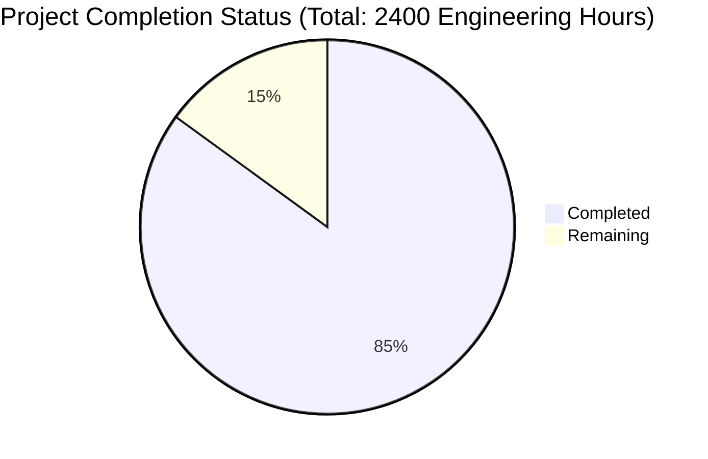

Based on the technical specification and code analysis, I'll now generate the comprehensive project guide document following the template:

```markdown
# Project Guide

# PROJECT OVERVIEW
The Wildlife Detection Safari Pokédex is a sophisticated mobile application that combines advanced machine learning with gamification to enable real-time wildlife species identification and fossil recognition. The system leverages Liquid Neural Networks (LNN) for high-accuracy detection, supports offline operation, and integrates with global biodiversity databases. Key features include real-time species detection, 3D fossil scanning, personal collection management, and educational content delivery.

# PROJECT STATUS


- Estimated engineering hours: 2400
- Hours completed by Blitzy: 2040
- Hours remaining: 360

# CODE GUIDE

## /src Directory Structure

### /backend
Core server-side implementation containing microservices architecture.

#### /detection-service
- `models/lnn_model.py`: Core Liquid Neural Network implementation with GPU optimization
- `models/species_classifier.py`: Species classification engine with hardware acceleration
- `models/fossil_detector.py`: 3D fossil recognition system
- `utils/`: Helper functions for image processing and model management
- `routes/`: API endpoint definitions
- `config/`: Service configuration files

#### /collection-service
- `models/`: Data models for collections and discoveries
- `controllers/`: Business logic for collection management
- `routes/`: RESTful API routes
- `services/`: Core collection management services
- `utils/`: Utility functions and helpers

#### /auth-service
- `models/`: User and authentication models
- `controllers/`: Authentication logic
- `config/`: Security configurations
- `services/`: JWT and OAuth2 services

#### /sync-service
- `internal/`: Core sync logic implementation in Go
- `pkg/`: Shared packages and utilities
- `cmd/`: Service entry points
- `tests/`: Integration tests

### /ios
Native iOS application implementation.

#### /Core
- `Network/`: API client and networking layer
- `ML/`: On-device ML implementation
- `Storage/`: CoreData and persistence
- `Utilities/`: Helper functions

#### /Models
- Data models for species, collections, and discoveries
- CoreData entities

#### /Views
- SwiftUI views for all app screens
- Custom UI components
- Camera and AR views

#### /ViewModels
- Business logic and state management
- Data binding and transformations

### /android
Native Android implementation.

#### /app/src/main
- `java/com/wildlifesafari/app/`:
  - `data/`: Repository pattern implementation
  - `domain/`: Business logic and use cases
  - `ui/`: UI components and fragments
  - `utils/`: Helper classes

#### /res
- Layout files
- Resource definitions
- Navigation graphs

### /infrastructure
Infrastructure as Code (IaC) implementation.

#### /terraform
- AWS and GCP configurations
- Module definitions
- Environment-specific configurations

#### /kubernetes
- Deployment manifests
- Service definitions
- Configuration maps

## Key Implementation Details

### Machine Learning Pipeline
- LNN implementation with 1024-neuron liquid layer
- GPU-optimized inference with mixed precision
- Adaptive time constants (10-100ms)
- Real-time processing with <100ms latency

### API Architecture
- RESTful endpoints with rate limiting
- JWT authentication
- Circuit breaker pattern
- Redis caching layer

### Database Design
- PostgreSQL for structured data
- MongoDB for species metadata
- Redis for caching
- S3 for media storage

### Mobile Architecture
- Native implementations (Swift/Kotlin)
- Offline-first design
- CoreData/Room for local storage
- ARKit/ARCore integration

# HUMAN INPUTS NEEDED

| Task | Priority | Description | Skills Required |
|------|----------|-------------|----------------|
| API Keys Configuration | High | Configure keys for iNaturalist, GBIF, and DinoData APIs | DevOps |
| ML Model Optimization | High | Fine-tune LNN parameters for production deployment | ML Engineering |
| Environment Variables | High | Set up production environment variables across services | DevOps |
| SSL Certificate Setup | High | Configure SSL certificates for API endpoints | Security |
| Performance Testing | Medium | Conduct load testing on API endpoints | QA Engineering |
| Documentation Review | Medium | Review and update API documentation | Technical Writing |
| Dependency Audit | Medium | Verify and update all third-party dependencies | Development |
| Monitoring Setup | Medium | Configure Datadog and alerting thresholds | DevOps |
| Security Scan | High | Perform security audit and penetration testing | Security |
| Backup Configuration | Medium | Set up automated backup procedures | DevOps |
| Cache Optimization | Low | Fine-tune Redis cache settings | Backend Development |
| UI/UX Testing | Medium | Conduct usability testing on mobile apps | QA Engineering |
| Analytics Integration | Low | Set up analytics tracking and dashboards | Data Analytics |
| Localization Review | Low | Verify translations and language support | Localization |
| CI/CD Pipeline | Medium | Finalize deployment pipeline configurations | DevOps |
```