# Technical Specifications

# 1. INTRODUCTION

## 1.1 EXECUTIVE SUMMARY

The Wildlife Detection Safari Pokédex is an innovative mobile application that leverages Liquid Neural Networks (LNN) to provide real-time identification and classification of wildlife species and dinosaur fossils. This system addresses the growing need for accessible wildlife education and citizen science by combining advanced machine learning capabilities with gamification elements. The primary stakeholders include nature enthusiasts, researchers, educational institutions, and conservation workers, with an expected impact of increasing wildlife awareness and contributing valuable data to global biodiversity research.

## 1.2 SYSTEM OVERVIEW

### Project Context

| Aspect | Details |
|--------|----------|
| Market Position | First-to-market mobile application combining wildlife detection with fossil recognition using LNN technology |
| Current Limitations | Existing solutions lack offline capabilities, 3D fossil recognition, and real-time processing |
| Enterprise Integration | Interfaces with iNaturalist, GBIF, and DinoData platforms while maintaining standalone functionality |

### High-Level Description

| Component | Implementation |
|-----------|---------------|
| Wildlife Detection | LNN-powered real-time species identification through device camera |
| Fossil Recognition | 3D scanning and matching against comprehensive fossil databases |
| Collection Management | Cloud-synced personal catalog of discoveries with offline capability |
| Educational Platform | Interactive species information and 3D model visualization |
| Data Contribution | Automated submission to global biodiversity databases |

### Success Criteria

| KPI Category | Target Metrics |
|--------------|---------------|
| Technical Performance | - 90% species identification accuracy<br>- Sub-100ms processing time<br>- 99.9% system availability |
| User Engagement | - 1M active users in first year<br>- 80% user retention rate<br>- Average 30 minutes daily usage |
| Scientific Impact | - 100,000 verified species observations monthly<br>- 1,000 research-grade contributions quarterly |

## 1.3 SCOPE

### In-Scope Elements

| Category | Components |
|----------|------------|
| Core Features | - Real-time wildlife detection<br>- 3D fossil scanning<br>- Digital collection management<br>- Educational content delivery<br>- Data contribution system |
| Implementation | - iOS and Android mobile applications<br>- Cloud-based processing infrastructure<br>- Offline-capable local database<br>- Multi-language support (top 10 languages) |
| User Groups | - Casual nature enthusiasts<br>- Professional researchers<br>- Educational institutions<br>- Conservation workers |
| Geographic Coverage | - Global deployment<br>- Region-specific species data<br>- Local language support |

### Out-of-Scope Elements

| Category | Exclusions |
|----------|------------|
| Features | - Live wildlife tracking<br>- Weather prediction<br>- Social networking capabilities<br>- Commercial specimen trading |
| Technical | - Desktop applications<br>- Web interface<br>- Custom hardware support<br>- Real-time video streaming |
| Data | - Genetic sequencing data<br>- Chemical composition analysis<br>- Archaeological artifacts<br>- Marine deep-sea species |
| Integration | - Tourism booking systems<br>- E-commerce platforms<br>- Gaming consoles<br>- Professional camera systems |

# 2. SYSTEM ARCHITECTURE

## 2.1 High-Level Architecture

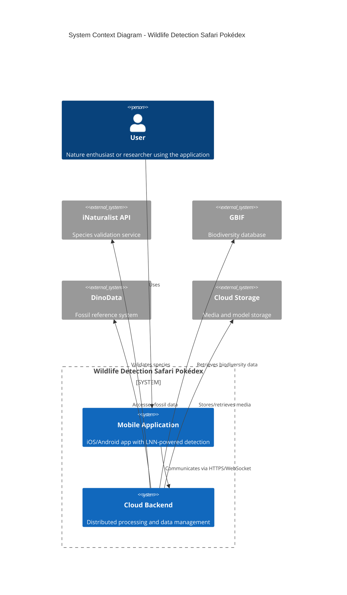

## 2.2 Container Architecture

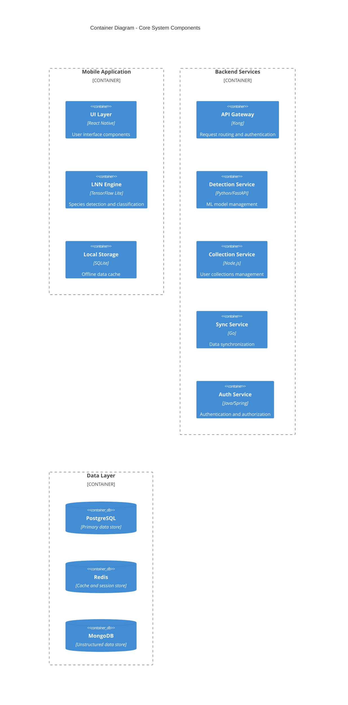

## 2.3 Component Details

### 2.3.1 Mobile Components

| Component | Technology | Purpose | Scaling Strategy |
|-----------|------------|---------|------------------|
| UI Layer | React Native | User interface rendering | Component-based architecture |
| LNN Engine | TensorFlow Lite | On-device ML inference | Model quantization |
| Local Storage | SQLite | Offline data persistence | Automatic pruning |
| Media Handler | Native APIs | Camera and sensor integration | Hardware abstraction |
| Sync Manager | Custom | Data synchronization | Queue-based processing |

### 2.3.2 Backend Components

| Component | Technology | Purpose | Scaling Strategy |
|-----------|------------|---------|------------------|
| API Gateway | Kong | Request routing | Horizontal scaling |
| Detection Service | FastAPI | ML operations | Auto-scaling pods |
| Collection Service | Node.js | Data management | Microservices pattern |
| Sync Service | Go | Data synchronization | Event-driven scaling |
| Auth Service | Spring Boot | Security management | Session clustering |

## 2.4 Data Flow Architecture

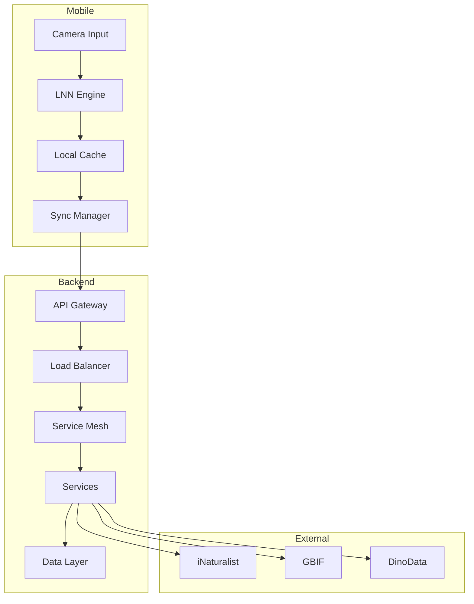

## 2.5 Deployment Architecture

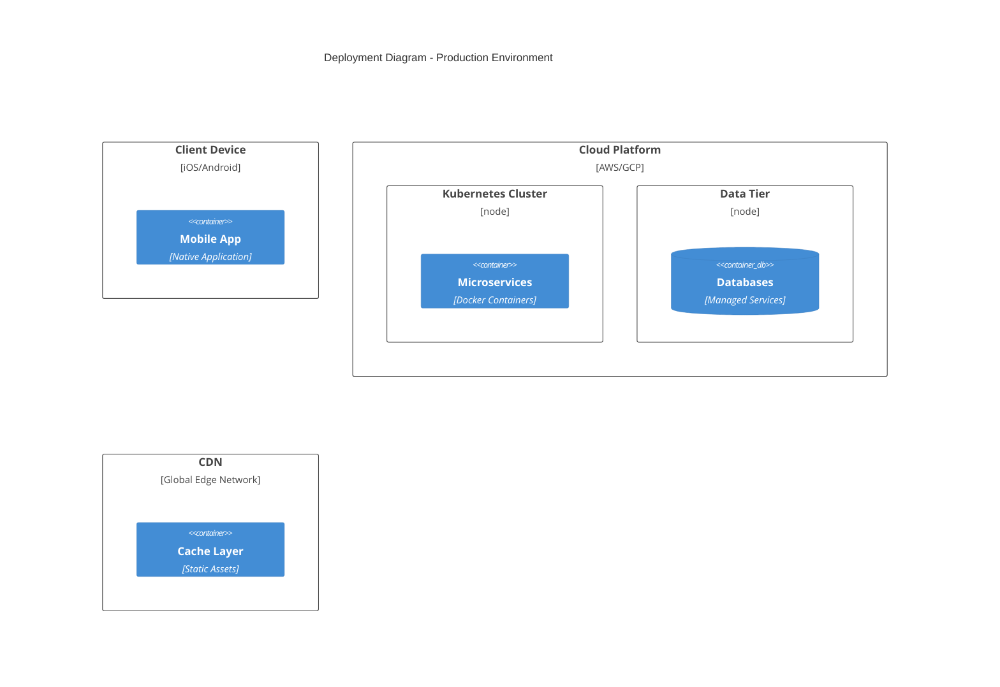

## 2.6 Cross-Cutting Concerns

### 2.6.1 Monitoring and Observability

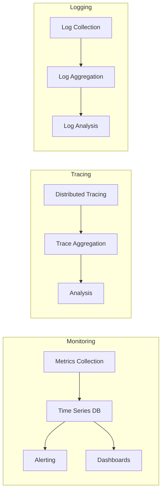

### 2.6.2 Security Architecture

| Layer | Mechanism | Implementation |
|-------|-----------|----------------|
| Network | TLS 1.3 | End-to-end encryption |
| Application | JWT | Token-based auth |
| Data | AES-256 | Encryption at rest |
| API | OAuth 2.0 | Authorization |
| Infrastructure | Zero Trust | Network isolation |

### 2.6.3 Disaster Recovery

| Component | RPO | RTO | Strategy |
|-----------|-----|-----|----------|
| User Data | 15 min | 1 hour | Multi-region replication |
| ML Models | 24 hours | 2 hours | Version control |
| Media Files | 1 hour | 4 hours | Geo-redundant storage |
| Config Data | 5 min | 30 min | Active-active setup |

# 3. SYSTEM COMPONENTS ARCHITECTURE

## 3.1 USER INTERFACE DESIGN

### 3.1.1 Design System Specifications

| Component | Specification | Implementation |
|-----------|--------------|----------------|
| Typography | SF Pro/Roboto | Primary: 16px, Headers: 20-32px |
| Color Palette | Nature-inspired | Primary: #2E7D32, Secondary: #1565C0 |
| Spacing System | 8px grid | Margins: 16/24/32px, Padding: 8/16/24px |
| Icons | Custom wildlife set | 24x24px SVG, 2px stroke |
| Elevation | 4 levels | Shadows: 2/4/8/16px spread |
| Motion | Natural easing | Duration: 200-300ms |
| Dark Mode | Auto-switching | WCAG AAA contrast ratios |

### 3.1.2 Layout Structure

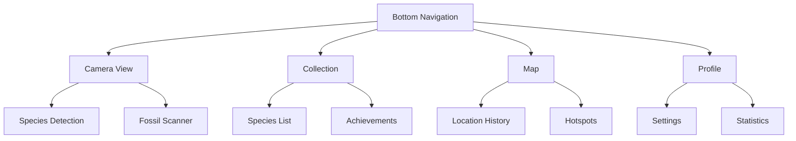

### 3.1.3 Critical User Flows

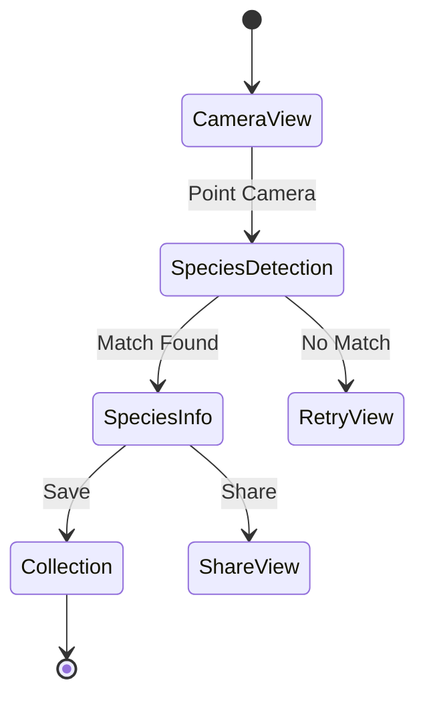

### 3.1.4 Accessibility Requirements

| Feature | Implementation | Standard |
|---------|---------------|-----------|
| Screen Readers | Dynamic ARIA labels | WCAG 2.1 AA |
| Color Contrast | Minimum 4.5:1 ratio | WCAG 2.1 AA |
| Touch Targets | Minimum 44x44px | WCAG 2.1 AA |
| Text Scaling | Up to 200% | WCAG 2.1 AA |
| Keyboard Nav | Full support | WCAG 2.1 AA |
| Voice Control | OS integration | Platform-specific |

## 3.2 DATABASE DESIGN

### 3.2.1 Schema Design

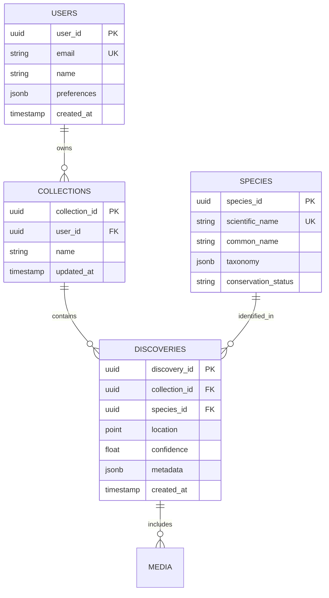

### 3.2.2 Data Management Strategy

| Aspect | Strategy | Implementation |
|--------|----------|----------------|
| Partitioning | Geographic sharding | By user location regions |
| Replication | Multi-region active-active | 3 geographic regions |
| Backup | Incremental daily | 30-day retention |
| Archival | Yearly cold storage | 7-year retention |
| Encryption | AES-256 at rest | Column-level encryption |
| Auditing | Change Data Capture | Debezium integration |

## 3.3 API DESIGN

### 3.3.1 API Architecture

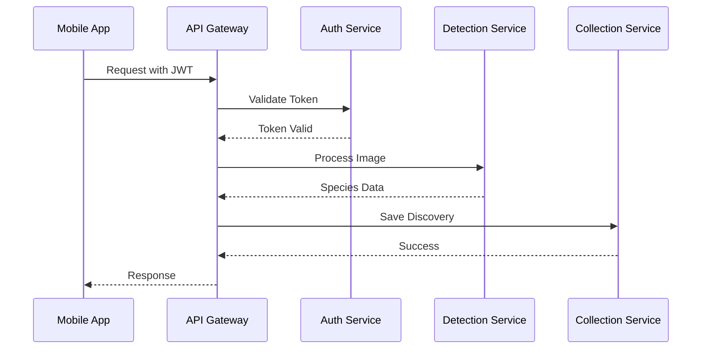

### 3.3.2 API Specifications

| Endpoint | Method | Purpose | Rate Limit |
|----------|--------|---------|------------|
| /api/v1/detect | POST | Species detection | 60/min |
| /api/v1/collections | GET/POST | Collection management | 120/min |
| /api/v1/species | GET | Species information | 300/min |
| /api/v1/sync | POST | Data synchronization | 30/min |
| /api/v1/media | PUT | Media upload | 100/min |

### 3.3.3 Integration Patterns

| Pattern | Implementation | Purpose |
|---------|---------------|---------|
| Circuit Breaker | Hystrix | Service resilience |
| Rate Limiting | Token bucket | API protection |
| Caching | Redis | Performance optimization |
| Authentication | JWT + OAuth2 | Security |
| Logging | ELK Stack | Monitoring |
| Service Discovery | Consul | Dynamic routing |

# 4. TECHNOLOGY STACK

## 4.1 PROGRAMMING LANGUAGES

| Platform/Component | Language | Version | Justification |
|-------------------|----------|---------|---------------|
| iOS App | Swift | 5.9 | Native performance for ML processing, camera integration |
| Android App | Kotlin | 1.9 | Modern Android development, coroutines for async LNN operations |
| Backend Services | Python | 3.11 | Extensive ML libraries, FastAPI performance |
| ML Pipeline | Python | 3.11 | TensorFlow/PyTorch compatibility, LNN implementation |
| Data Processing | Go | 1.21 | High-performance sync services, concurrent operations |
| Infrastructure | TypeScript | 5.0 | Type-safe IaC with AWS CDK |

## 4.2 FRAMEWORKS & LIBRARIES

### Mobile Development

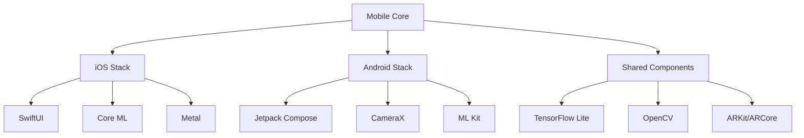

| Framework | Version | Purpose | Justification |
|-----------|---------|---------|---------------|
| SwiftUI/Jetpack Compose | Latest | UI Framework | Modern declarative UI, performance |
| TensorFlow Lite | 2.14 | ML Runtime | Optimized mobile inference, LNN support |
| OpenCV | 4.8 | Image Processing | Real-time camera feed analysis |
| ARKit/ARCore | Latest | 3D Visualization | Fossil model rendering |

## 4.3 DATABASES & STORAGE

### Data Architecture

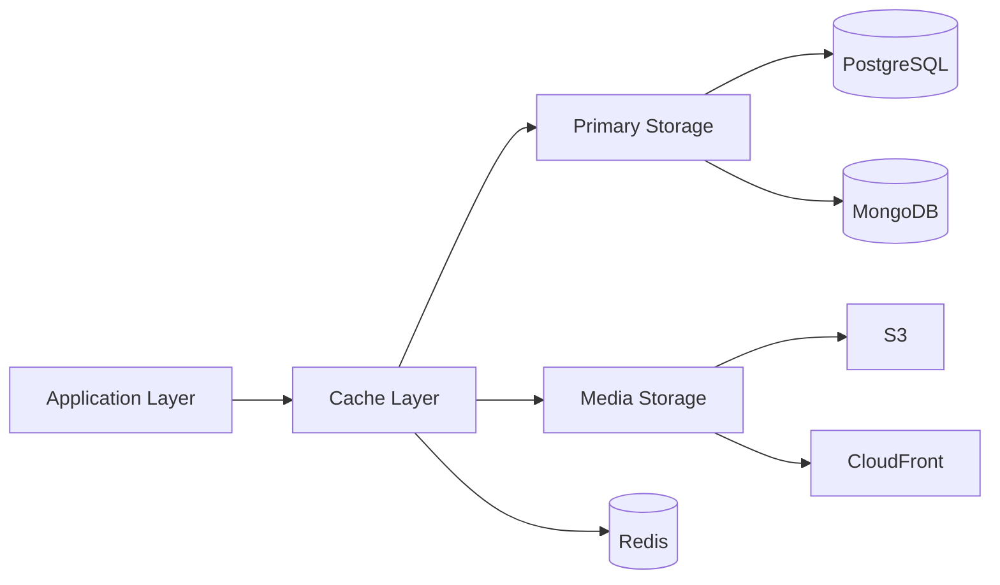

| Component | Technology | Version | Purpose |
|-----------|------------|---------|----------|
| Primary DB | PostgreSQL | 15 | Structured data, ACID compliance |
| Document Store | MongoDB | 6.0 | Species/fossil metadata |
| Cache | Redis | 7.0 | Session, real-time data |
| Object Storage | S3 | - | Media, 3D models |
| CDN | CloudFront | - | Global content delivery |

## 4.4 THIRD-PARTY SERVICES

| Service | Purpose | Integration Method |
|---------|---------|-------------------|
| iNaturalist API | Species validation | REST API |
| GBIF API | Biodiversity data | GraphQL |
| DinoData | Fossil database | REST API |
| Auth0 | Authentication | OAuth 2.0/OIDC |
| Datadog | Monitoring | Agent/API |
| Sentry | Error tracking | SDK |

## 4.5 DEVELOPMENT & DEPLOYMENT

### CI/CD Pipeline

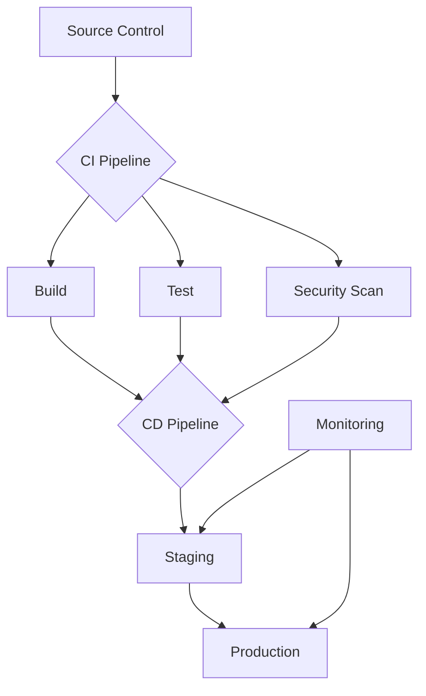

| Category | Tool | Version | Purpose |
|----------|------|---------|----------|
| Source Control | GitHub Enterprise | Latest | Code repository |
| CI/CD | GitHub Actions | Latest | Automation pipeline |
| Containers | Docker | 24.0 | Application packaging |
| Orchestration | EKS | 1.27 | Container management |
| IaC | AWS CDK | 2.0 | Infrastructure management |
| Monitoring | Datadog | Latest | Observability |

### Development Environment

| Tool | Version | Purpose |
|------|---------|----------|
| Xcode | 15 | iOS development |
| Android Studio | 2023.1 | Android development |
| VS Code | Latest | Backend development |
| PyCharm | 2023.2 | ML development |
| Docker Desktop | Latest | Local containers |

# 5. SYSTEM DESIGN

## 5.1 USER INTERFACE DESIGN

### 5.1.1 Core Screen Layouts

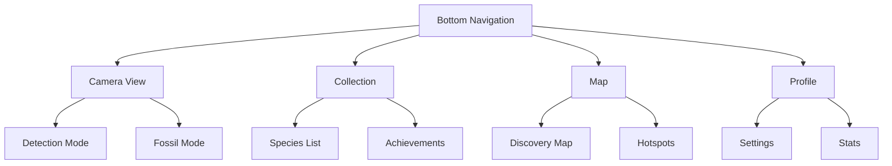

### 5.1.2 Camera View Layout

| Component | Position | Functionality |
|-----------|----------|---------------|
| Camera Feed | Full screen | Live preview with AR overlay |
| Mode Toggle | Top-left | Switch between wildlife/fossil modes |
| Flash Control | Top-right | Toggle device flash |
| Capture Button | Bottom-center | Trigger detection/capture |
| Species Info | Bottom sheet | Sliding panel with detected info |
| Settings | Top-right | Quick access camera settings |

### 5.1.3 Collection View Organization

| Section | Layout | Features |
|---------|--------|----------|
| Grid View | 3-column | Thumbnail previews with badges |
| List View | Full-width | Detailed species information |
| Filters | Top bar | Species, date, location filters |
| Search | Sticky header | Full-text search with suggestions |
| Sort Options | Dropdown | By date, name, rarity |

## 5.2 DATABASE DESIGN

### 5.2.1 Schema Design


### 5.2.2 Data Management Strategy

| Aspect | Strategy | Implementation |
|--------|----------|----------------|
| Partitioning | Geographic sharding | By user location regions |
| Replication | Multi-region active-active | 3 geographic regions |
| Backup | Incremental daily | 30-day retention |
| Archival | Yearly cold storage | 7-year retention |
| Encryption | AES-256 at rest | Column-level encryption |
| Auditing | Change Data Capture | Debezium integration |

## 5.3 API DESIGN

### 5.3.1 API Architecture


### 5.3.2 API Endpoints

| Endpoint | Method | Purpose | Rate Limit |
|----------|--------|---------|------------|
| /api/v1/detect | POST | Species detection | 60/min |
| /api/v1/collections | GET/POST | Collection management | 120/min |
| /api/v1/species | GET | Species information | 300/min |
| /api/v1/sync | POST | Data synchronization | 30/min |
| /api/v1/media | PUT | Media upload | 100/min |

### 5.3.3 Integration Patterns

| Pattern | Implementation | Purpose |
|---------|---------------|---------|
| Circuit Breaker | Hystrix | Service resilience |
| Rate Limiting | Token bucket | API protection |
| Caching | Redis | Performance optimization |
| Authentication | JWT + OAuth2 | Security |
| Logging | ELK Stack | Monitoring |
| Service Discovery | Consul | Dynamic routing |

### 5.3.4 Error Handling

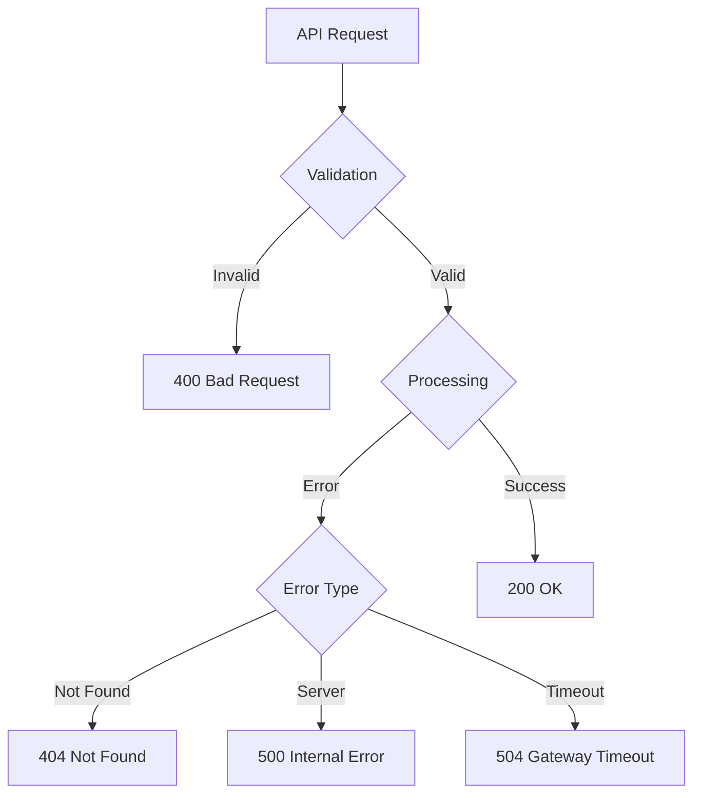

### 5.3.5 Response Format

| Field | Type | Description |
|-------|------|-------------|
| status | string | Request status |
| data | object | Response payload |
| errors | array | Error details |
| meta | object | Pagination/metadata |
| links | object | HATEOAS links |
| timestamp | string | Response time |

# 6. USER INTERFACE DESIGN

## 6.1 Common Elements

### Navigation Bar
```
+----------------------------------------------------------+
| [#] Dashboard  [@] Profile  [*] Collection  [=] Settings   |
+----------------------------------------------------------+
```

### Alert System
```
+----------------------------------------------------------+
| [!] Species identification in progress...     [x]          |
+----------------------------------------------------------+
```

## 6.2 Main Camera Interface
```
+----------------------------------------------------------+
| [=] Menu                              [@] Profile    [?]   |
|                                                           |
|                   +---------------+                        |
|                   |   CAMERA      |                       |
|                   |   PREVIEW     |                       |
|                   |               |                       |
|                   |  [AI Active]  |                       |
|                   |               |                       |
|                   +---------------+                        |
|                                                           |
|    [Mode: Wildlife v]                   [Flash: Auto v]   |
|                                                           |
|    [<] Gallery    [O] Capture    [>] Collection          |
+----------------------------------------------------------+
```

## 6.3 Species Information View
```
+----------------------------------------------------------+
| [<] Back                              [*] Save    [^]Share |
|                                                           |
|     +------------------------------------------+         |
|     |              Species Image               |         |
|     |                                         |         |
|     +------------------------------------------+         |
|                                                           |
| Common Name: Red-tailed Hawk                              |
| Scientific Name: Buteo jamaicensis                        |
|                                                           |
| Conservation Status: [====--------] Least Concern         |
|                                                           |
| Details:                                                  |
| +--------------------------------------------------+     |
| | • Size: 45-65cm                                  |     |
| | • Habitat: Open woodlands                        |     |
| | • Diet: Small mammals, birds                     |     |
| +--------------------------------------------------+     |
|                                                           |
| [More Info]        [Add to Collection]      [Report]      |
+----------------------------------------------------------+
```

## 6.4 Collection View
```
+----------------------------------------------------------+
| My Collection                    [Search...]    [Filter v] |
|                                                           |
| Sort by: [Recent v]              View: [Grid v]           |
|                                                           |
| +----------+  +----------+  +----------+  +----------+    |
| |Species 1 |  |Species 2 |  |Species 3 |  |Species 4 |   |
| |[*]       |  |          |  |[*]       |  |          |   |
| |          |  |          |  |          |  |          |   |
| +----------+  +----------+  +----------+  +----------+    |
|                                                           |
| +----------+  +----------+  +----------+  +----------+    |
| |Species 5 |  |Species 6 |  |Species 7 |  |Species 8 |   |
| |          |  |[*]       |  |          |  |          |   |
| |          |  |          |  |          |  |          |   |
| +----------+  +----------+  +----------+  +----------+    |
|                                                           |
| [< Previous]                              [Next >]        |
+----------------------------------------------------------+
```

## 6.5 3D Fossil View
```
+----------------------------------------------------------+
| [<] Back                              [Download]  [Share]  |
|                                                           |
|     +------------------------------------------+         |
|     |                                          |         |
|     |             3D MODEL VIEWER              |         |
|     |                                          |         |
|     |         [Rotate] [Zoom] [Pan]           |         |
|     |                                          |         |
|     +------------------------------------------+         |
|                                                           |
| Fossil Name: Tyrannosaurus Rex Skull                     |
| Period: Late Cretaceous                                  |
|                                                           |
| Measurements:                                             |
| +--------------------------------------------------+     |
| | Length: 1.5m                                     |     |
| | Height: 1.2m                                     |     |
| | Estimated Age: 66 million years                  |     |
| +--------------------------------------------------+     |
|                                                           |
| [View in AR]        [Add to Collection]    [Learn More]   |
+----------------------------------------------------------+
```

## 6.6 Settings Interface
```
+----------------------------------------------------------+
| Settings                                         [<] Back  |
|                                                           |
| Account                                                   |
| +--------------------------------------------------+     |
| | [@] Profile Settings                             |     |
| | [!] Notifications                                |     |
| | [$] Subscription Status                          |     |
| +--------------------------------------------------+     |
|                                                           |
| Application                                               |
| +--------------------------------------------------+     |
| | [v] Language: English                            |     |
| | [ ] Dark Mode                                    |     |
| | [ ] Offline Mode                                 |     |
| | [====] Cache Size: 1.2GB                        |     |
| +--------------------------------------------------+     |
|                                                           |
| Camera                                                    |
| +--------------------------------------------------+     |
| | [v] Resolution: High                             |     |
| | [v] AI Processing: Real-time                     |     |
| | [ ] Save Original Photos                         |     |
| +--------------------------------------------------+     |
|                                                           |
| [Save Changes]                    [Reset to Default]      |
+----------------------------------------------------------+
```

### Key/Legend
```
Icons:
[?] - Help/Information
[$] - Payment/Subscription
[i] - Information
[+] - Add/Create
[x] - Close/Delete
[<] [>] - Navigation
[^] - Share/Upload
[#] - Menu/Dashboard
[@] - User/Profile
[!] - Alert/Warning
[=] - Settings
[*] - Favorite/Important
[O] - Capture Button

Interactive Elements:
[ ] - Checkbox
( ) - Radio Button
[Button] - Clickable Button
[...] - Text Input Field
[====] - Progress Bar
[v] - Dropdown Menu

Borders:
+--+ - Container Corners
|  | - Container Sides
+-- - Hierarchical Elements
```

# 7. SECURITY CONSIDERATIONS

## 7.1 AUTHENTICATION AND AUTHORIZATION

### 7.1.1 Authentication Methods

| Method | Implementation | Use Case |
|--------|---------------|-----------|
| OAuth 2.0 + OIDC | Auth0 integration | Primary user authentication |
| Biometric | Native iOS/Android APIs | Mobile app access |
| API Keys | JWT with RS256 | External service authentication |
| MFA | TOTP/SMS | High-privilege operations |
| SSO | SAML 2.0 | Institutional access |

### 7.1.2 Authorization Model

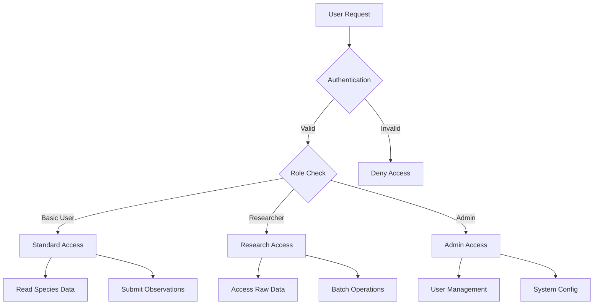

### 7.1.3 Role-Based Access Control

| Role | Permissions | Access Level |
|------|------------|--------------|
| Anonymous | View public species data | Read-only |
| Basic User | Submit observations, manage personal collection | Create, Read |
| Researcher | Access research data, bulk export | Create, Read, Export |
| Moderator | Verify submissions, manage content | Create, Read, Update |
| Administrator | Full system access | Full CRUD |

## 7.2 DATA SECURITY

### 7.2.1 Data Classification

| Data Type | Classification | Protection Level | Encryption |
|-----------|---------------|------------------|------------|
| User Credentials | Critical | Highest | AES-256 + Key Rotation |
| Species Location | Sensitive | High | AES-256 |
| Research Data | Confidential | High | AES-256 |
| Public Species Info | Public | Standard | TLS in Transit |
| Usage Analytics | Internal | Moderate | AES-256 |

### 7.2.2 Encryption Strategy

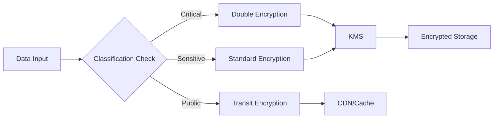

### 7.2.3 Key Management

| Component | Implementation | Rotation Period |
|-----------|---------------|-----------------|
| Master Keys | AWS KMS | 90 days |
| Data Keys | Envelope Encryption | 30 days |
| API Keys | JWT RS256 | 7 days |
| Session Keys | Redis + AES | 24 hours |
| Backup Keys | HSM Backed | 180 days |

## 7.3 SECURITY PROTOCOLS

### 7.3.1 Network Security

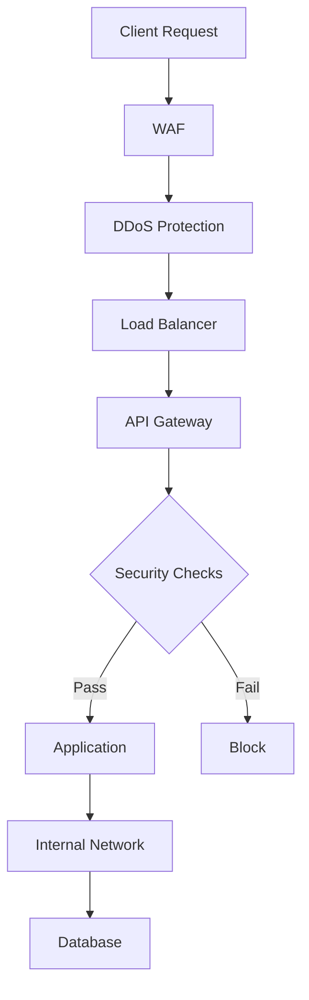

### 7.3.2 Security Standards Compliance

| Standard | Implementation | Verification |
|----------|---------------|--------------|
| OWASP Top 10 | Security controls and testing | Quarterly audits |
| GDPR | Data protection measures | Annual certification |
| ISO 27001 | ISMS implementation | External audit |
| NIST 800-53 | Security controls | Continuous monitoring |
| PCI DSS | Payment security | Annual assessment |

### 7.3.3 Security Monitoring

| Component | Tool | Purpose |
|-----------|------|---------|
| SIEM | Datadog Security | Log analysis and alerts |
| WAF | AWS WAF | Web attack protection |
| IDS/IPS | Snort | Network intrusion detection |
| Vulnerability Scanner | Nessus | System vulnerability assessment |
| Container Security | Aqua Security | Container runtime protection |

### 7.3.4 Incident Response

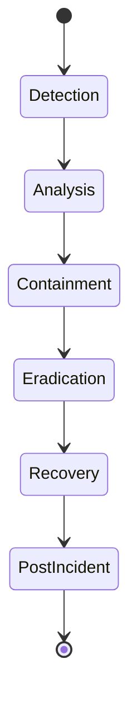

| Phase | Actions | Responsible Team |
|-------|---------|-----------------|
| Detection | Alert monitoring, Log analysis | Security Operations |
| Analysis | Threat assessment, Impact evaluation | Security Team |
| Containment | Isolation, Access control | DevOps + Security |
| Eradication | Remove threat, Patch vulnerabilities | Development Team |
| Recovery | Service restoration, Data validation | Operations Team |
| Post-Incident | Documentation, Process improvement | All Teams |

# 8. INFRASTRUCTURE

## 8.1 DEPLOYMENT ENVIRONMENT

### 8.1.1 Environment Architecture

```mermaid
flowchart TD
    subgraph Production
        A[Load Balancer] --> B[Application Cluster]
        B --> C[(Primary Database)]
        B --> D[Cache Layer]
        B --> E[Object Storage]
    end
    
    subgraph Staging
        F[Staging Cluster] --> G[(Staging DB)]
    end
    
    subgraph Development
        H[Dev Environment] --> I[(Dev DB)]
    end
    
    J[CI/CD Pipeline] --> Production
    J --> Staging
    J --> Development
```

| Environment | Purpose | Infrastructure |
|-------------|---------|----------------|
| Production | Live user-facing system | Multi-region cloud deployment |
| Staging | Pre-production testing | Single-region cloud deployment |
| Development | Development and testing | Hybrid (cloud + local) |
| DR Site | Disaster recovery | Secondary cloud region |

## 8.2 CLOUD SERVICES

### 8.2.1 Primary Cloud Provider: AWS

| Service | Purpose | Configuration |
|---------|---------|--------------|
| EKS | Kubernetes orchestration | Multi-AZ, 3 regions |
| RDS | PostgreSQL database | Multi-AZ, auto-scaling |
| ElastiCache | Redis caching | Cluster mode enabled |
| S3 | Object storage | Cross-region replication |
| CloudFront | Global CDN | Edge locations worldwide |
| Lambda | Serverless processing | Auto-scaling compute |
| SageMaker | ML model hosting | GPU-enabled instances |

### 8.2.2 Secondary Services: GCP

| Service | Purpose | Usage |
|---------|---------|-------|
| Cloud Storage | Backup storage | Cross-cloud redundancy |
| BigQuery | Analytics platform | Data warehousing |
| Cloud Vision API | Backup ML processing | Failover support |

## 8.3 CONTAINERIZATION

### 8.3.1 Container Architecture

```mermaid
flowchart LR
    subgraph Base Images
        A[Python 3.11] --> B[ML Runtime]
        C[Node.js 18] --> D[API Services]
        E[Go 1.21] --> F[Data Services]
    end
    
    subgraph Application Containers
        B --> G[Detection Service]
        D --> H[Collection Service]
        F --> I[Sync Service]
    end
    
    subgraph Supporting Services
        J[Redis]
        K[PostgreSQL]
        L[MongoDB]
    end
```

### 8.3.2 Container Specifications

| Container | Base Image | Resource Limits |
|-----------|------------|-----------------|
| Detection Service | python:3.11-slim | CPU: 4, RAM: 8GB |
| Collection Service | node:18-alpine | CPU: 2, RAM: 4GB |
| Sync Service | golang:1.21-alpine | CPU: 2, RAM: 4GB |
| Cache Service | redis:7.0-alpine | CPU: 2, RAM: 8GB |

## 8.4 ORCHESTRATION

### 8.4.1 Kubernetes Configuration

```mermaid
flowchart TD
    subgraph Kubernetes Cluster
        A[Ingress Controller] --> B[Service Mesh]
        B --> C[Application Pods]
        B --> D[Background Jobs]
        
        C --> E[HPA]
        C --> F[PDB]
        
        G[Config Maps] --> C
        H[Secrets] --> C
    end
```

### 8.4.2 Cluster Specifications

| Component | Configuration | Scaling Policy |
|-----------|--------------|----------------|
| Control Plane | Multi-master HA | N/A |
| Worker Nodes | c5.2xlarge | Auto-scaling (5-50) |
| Node Groups | CPU/GPU optimized | Zone balanced |
| Network Policy | Calico | Default deny |
| Service Mesh | Istio | mTLS enabled |

## 8.5 CI/CD PIPELINE

### 8.5.1 Pipeline Architecture

```mermaid
flowchart LR
    A[Source Code] --> B[Build Stage]
    B --> C{Tests}
    C -->|Pass| D[Security Scan]
    C -->|Fail| E[Notify Team]
    D -->|Pass| F[Deploy Staging]
    F --> G{Integration Tests}
    G -->|Pass| H[Deploy Production]
    G -->|Fail| E
```

### 8.5.2 Pipeline Stages

| Stage | Tools | SLA |
|-------|-------|-----|
| Code Analysis | SonarQube | < 10 minutes |
| Unit Tests | Jest, PyTest | < 15 minutes |
| Security Scan | Snyk, OWASP | < 20 minutes |
| Build | Docker | < 10 minutes |
| Integration Tests | Cypress | < 30 minutes |
| Deployment | ArgoCD | < 15 minutes |

### 8.5.3 Deployment Strategy

| Environment | Strategy | Rollback Time |
|-------------|----------|---------------|
| Production | Blue-Green | < 5 minutes |
| Staging | Rolling Update | < 2 minutes |
| Development | Direct Deploy | Immediate |

### 8.5.4 Monitoring Integration

| Tool | Purpose | Integration Point |
|------|---------|------------------|
| Datadog | Performance monitoring | Post-deployment |
| PagerDuty | Alert management | All stages |
| Grafana | Metrics visualization | Continuous |
| ELK Stack | Log aggregation | All stages |

# 8. APPENDICES

## 8.1 ADDITIONAL TECHNICAL INFORMATION

### Machine Learning Model Parameters

| Parameter | Value | Description |
|-----------|--------|------------|
| LNN Layer Size | 1024 neurons | Primary liquid layer capacity |
| Time Constants | 10-100ms | Neural dynamics range |
| Learning Rate | 0.001 | Adaptive gradient descent rate |
| Batch Size | 32 | Training batch size |
| Input Resolution | 640x640 px | Image processing size |
| Model Quantization | INT8 | Mobile optimization level |

### Dataset Integration Specifications

```mermaid
flowchart LR
    A[Raw Datasets] --> B{Preprocessing}
    B --> C[iNaturalist]
    B --> D[GBIF]
    B --> E[DinoData]
    
    C --> F[Data Fusion]
    D --> F
    E --> F
    
    F --> G[Model Training]
    G --> H[Deployment]
    
    H --> I[Mobile Cache]
    H --> J[Cloud Storage]
```

### Hardware Compatibility Matrix

| Device Class | Minimum Requirements | Optimal Requirements |
|--------------|---------------------|---------------------|
| iOS Devices | iPhone X or newer | iPhone 12 or newer |
| Android Devices | ARCore compatible | Snapdragon 865+ |
| RAM | 4GB | 8GB |
| Storage | 64GB | 128GB |
| Camera | 12MP | 48MP with LiDAR |
| GPU | Metal 2.0/OpenGL ES 3.1 | Metal 2.3/Vulkan 1.1 |

## 8.2 GLOSSARY

| Term | Definition |
|------|------------|
| Adaptive Gradient Descent | Machine learning optimization technique that adjusts learning rates dynamically |
| ARCore | Google's platform for building augmented reality experiences |
| Data Fusion | Process of integrating multiple data sources into a coherent dataset |
| Edge Computing | Processing data near the source of data generation |
| Envelope Encryption | Technique using a master key to encrypt data encryption keys |
| Feature Extraction | Process of deriving informative values from image data |
| Model Quantization | Technique to reduce neural network size while preserving accuracy |
| Transfer Learning | Reusing pre-trained models for new but related tasks |
| Zero-Shot Learning | Ability to recognize objects without prior training examples |
| mTLS | Mutual TLS authentication where both client and server verify each other |

## 8.3 ACRONYMS

| Acronym | Full Form |
|---------|-----------|
| API | Application Programming Interface |
| CRUD | Create, Read, Update, Delete |
| CDN | Content Delivery Network |
| GBIF | Global Biodiversity Information Facility |
| GPU | Graphics Processing Unit |
| HATEOAS | Hypermedia As The Engine Of Application State |
| JWT | JSON Web Token |
| LiDAR | Light Detection and Ranging |
| OIDC | OpenID Connect |
| REST | Representational State Transfer |
| SDK | Software Development Kit |
| TLS | Transport Layer Security |
| TOTP | Time-based One-Time Password |
| WCAG | Web Content Accessibility Guidelines |
| WAF | Web Application Firewall |

## 8.4 REFERENCE ARCHITECTURE

```mermaid
C4Context
    title Reference Architecture - Wildlife Detection Safari Pokédex

    Person(user, "End User", "Application user with mobile device")
    
    System_Boundary(app, "Mobile Application") {
        Container(ui, "UI Layer", "React Native")
        Container(ml, "ML Engine", "TensorFlow Lite/LNN")
        Container(local, "Local Storage", "SQLite")
    }
    
    System_Boundary(cloud, "Cloud Infrastructure") {
        Container(api, "API Gateway", "Kong")
        Container(services, "Microservices", "Node.js/Python")
        Container(ml_train, "ML Training", "TensorFlow/PyTorch")
        ContainerDb(storage, "Data Storage", "PostgreSQL/Redis")
    }
    
    System_Ext(datasets, "External Datasets", "iNaturalist/GBIF/DinoData")
    
    Rel(user, app, "Uses")
    Rel(app, cloud, "API Calls")
    Rel(cloud, datasets, "Data Integration")
```