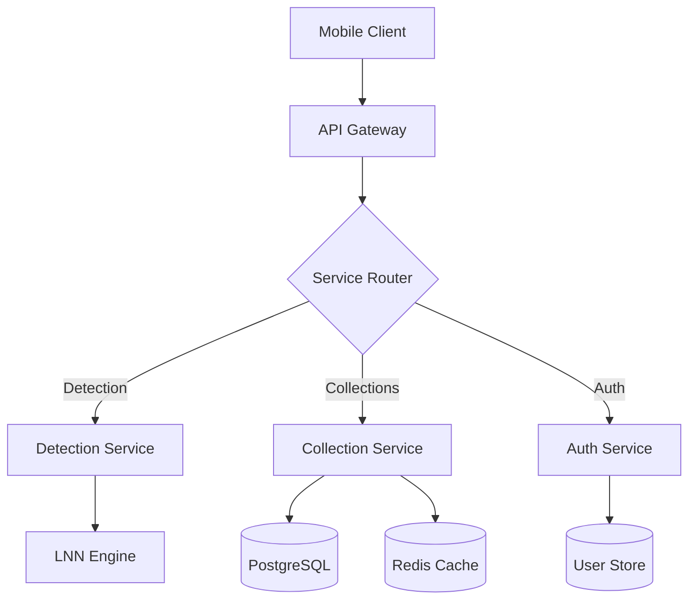
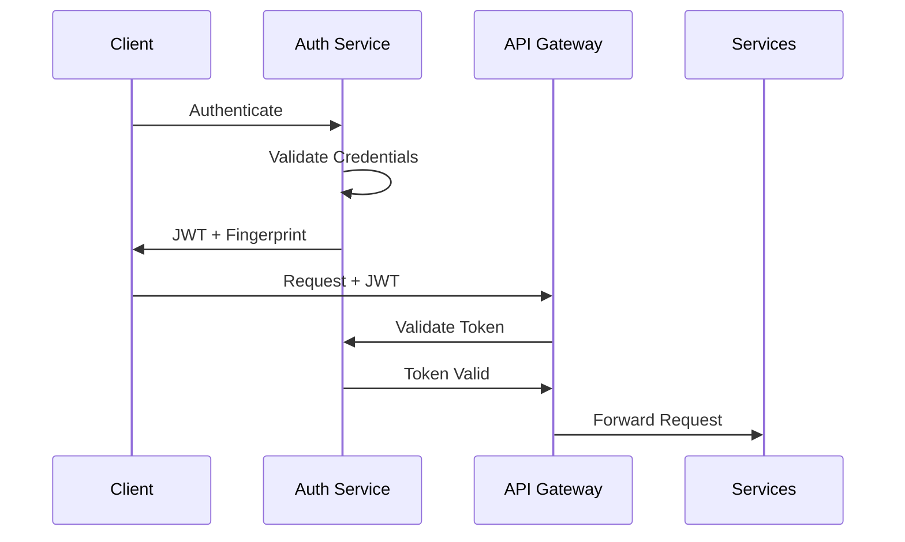

# Wildlife Detection Safari Pokédex - Backend System Documentation

## Table of Contents
1. [System Overview](#1-system-overview)
2. [Architecture](#2-architecture)
3. [Core Services](#3-core-services)
4. [Security](#4-security)
5. [Performance Optimization](#5-performance-optimization)
6. [Development Setup](#6-development-setup)
7. [Deployment Guide](#7-deployment-guide)
8. [Monitoring & Operations](#8-monitoring--operations)

## 1. System Overview

The Wildlife Detection Safari Pokédex backend system is a distributed microservices architecture implementing real-time wildlife and fossil detection using Liquid Neural Networks (LNN). The system is designed to achieve:

- Sub-100ms processing time
- 99.9% system availability
- 90% species identification accuracy
- Support for 1M+ active users

### 1.1 Key Components

```mermaid
C4Context
    title System Context - Wildlife Detection Safari Pokédex

    Person(user, "User", "Mobile application user")
    
    System_Boundary(backend, "Backend Services") {
        System(detection, "Detection Service", "FastAPI - LNN-powered detection")
        System(collection, "Collection Service", "Node.js - Collection management")
        System(auth, "Auth Service", "Spring Boot - Security")
    }
    
    System_Ext(iNaturalist, "iNaturalist API", "Species validation")
    System_Ext(gbif, "GBIF", "Biodiversity data")
    
    Rel(user, backend, "Uses", "HTTPS/JWT")
    Rel(backend, iNaturalist, "Validates")
    Rel(backend, gbif, "Queries")
```

## 2. Architecture

### 2.1 Service Architecture

The system follows a microservices architecture with three core services:

1. **Detection Service** (FastAPI/Python)
   - Real-time species detection using LNN
   - Fossil recognition with 3D modeling
   - Batch processing capabilities
   - Hardware-accelerated image processing

2. **Collection Service** (Node.js/Express)
   - User collection management
   - Discovery tracking and synchronization
   - Redis-backed caching
   - PostgreSQL data persistence

3. **Authentication Service** (Spring Boot/Java)
   - JWT-based authentication
   - OAuth2/OIDC integration
   - Role-based access control
   - Biometric authentication support

### 2.2 Data Flow



## 3. Core Services

### 3.1 Detection Service

- **Technology Stack**: Python 3.11, FastAPI, TensorFlow 2.14
- **Key Features**:
  - LNN-based species classification
  - 3D fossil scanning and analysis
  - Real-time image processing
  - Batch processing support
- **Performance Targets**:
  - Processing time: <100ms
  - Accuracy: >90%
  - Batch size: Up to 32 images

### 3.2 Collection Service

- **Technology Stack**: Node.js 18, Express 4.18
- **Key Features**:
  - CRUD operations for collections
  - Real-time synchronization
  - Redis caching
  - Pagination support
- **Performance Features**:
  - Response time: <50ms
  - Cache hit ratio: >90%
  - Concurrent users: 10,000+

### 3.3 Authentication Service

- **Technology Stack**: Java 17, Spring Boot 2.7
- **Key Features**:
  - JWT with RS256 signing
  - OAuth2/OIDC providers
  - Biometric authentication
  - Token fingerprinting
- **Security Features**:
  - Token rotation
  - Rate limiting
  - Brute force protection
  - Audit logging

## 4. Security

### 4.1 Authentication Flow



### 4.2 Security Measures

- JWT with RS256 signing and key rotation
- Token fingerprinting for replay protection
- Rate limiting per endpoint
- CORS with strict origin policy
- Input validation and sanitization
- SQL injection prevention
- XSS protection headers

## 5. Performance Optimization

### 5.1 Caching Strategy

- **Redis Cache**:
  - Authentication tokens
  - User sessions
  - Collection metadata
  - Detection results

- **Local Memory Cache**:
  - ML models
  - Frequently accessed data
  - API responses

### 5.2 Database Optimization

- Connection pooling
- Query optimization
- Indexing strategy
- Partitioning scheme

## 6. Development Setup

### 6.1 Prerequisites

```bash
# Required software versions
Python 3.11+
Node.js 18+
Java 17+
Redis 7.0+
PostgreSQL 15+
```

### 6.2 Environment Setup

```bash
# Clone repository
git clone https://github.com/wildlife-safari/backend.git

# Install dependencies
cd backend
./scripts/install-dependencies.sh

# Configure environment
cp .env.example .env
# Edit .env with your configuration

# Start services
docker-compose up -d
```

## 7. Deployment Guide

### 7.1 Production Deployment

```bash
# Build containers
docker-compose -f docker-compose.prod.yml build

# Deploy to Kubernetes
kubectl apply -f kubernetes/

# Verify deployment
kubectl get pods -n wildlife-safari
```

### 7.2 Scaling Configuration

```yaml
# kubernetes/detection-service.yaml
apiVersion: apps/v1
kind: Deployment
metadata:
  name: detection-service
spec:
  replicas: 3
  strategy:
    type: RollingUpdate
```

## 8. Monitoring & Operations

### 8.1 Health Checks

- `/health` endpoint on each service
- Kubernetes liveness/readiness probes
- Database connection monitoring
- Cache availability checks

### 8.2 Metrics Collection

- Request latency
- Error rates
- Resource utilization
- Cache hit ratios
- ML model performance

### 8.3 Logging

- Structured JSON logging
- Correlation IDs
- Error tracking with Sentry
- Audit logging for security events

## License

Copyright © 2024 Wildlife Safari Pokédex. All rights reserved.