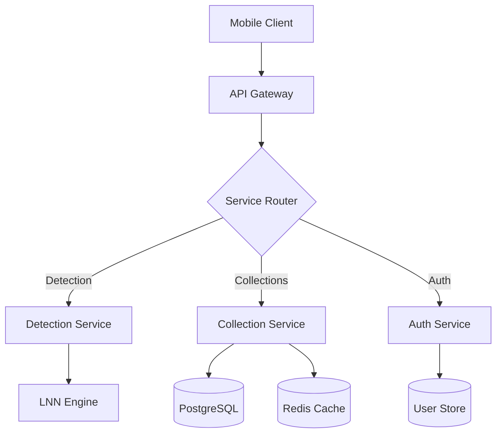
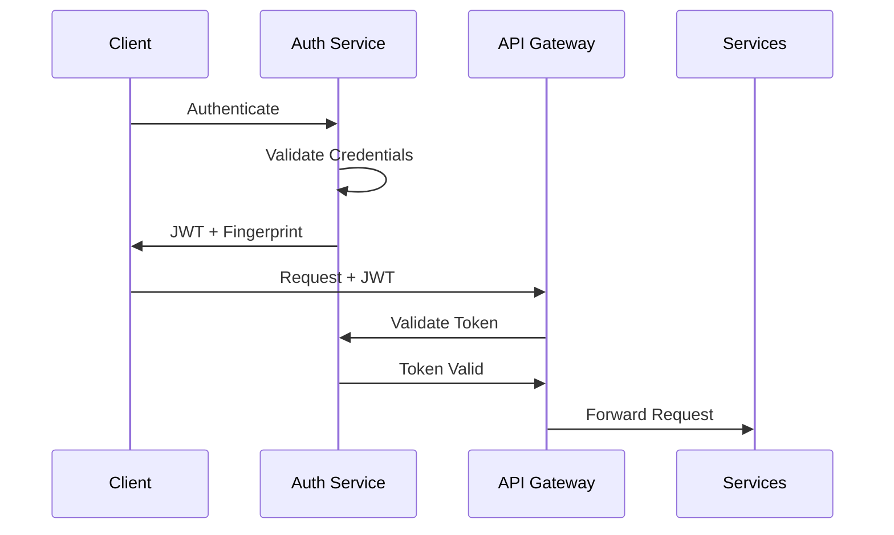
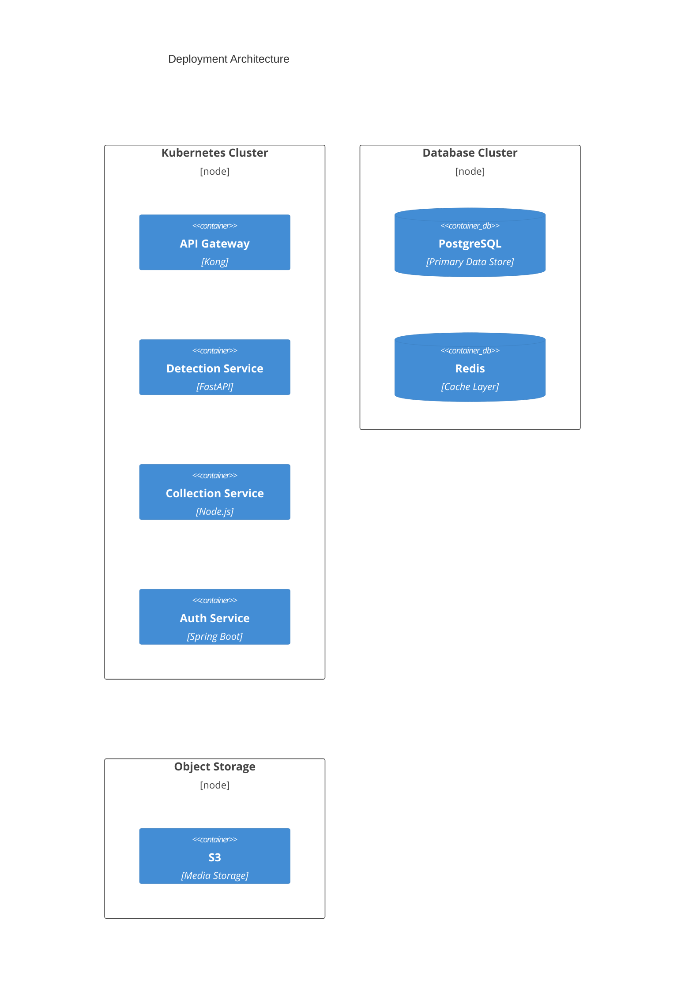

# Wildlife Detection Safari Pokédex - System Architecture Documentation

## Table of Contents
1. [System Overview](#1-system-overview)
2. [Core Services Architecture](#2-core-services-architecture)
3. [Data Flow Architecture](#3-data-flow-architecture)
4. [Security Architecture](#4-security-architecture)
5. [Performance Architecture](#5-performance-architecture)
6. [Deployment Architecture](#6-deployment-architecture)
7. [Disaster Recovery](#7-disaster-recovery)

## 1. System Overview

The Wildlife Detection Safari Pokédex is a distributed microservices system implementing real-time wildlife and fossil detection using Liquid Neural Networks (LNN). The system is designed for high availability (99.9%) with sub-100ms processing requirements.

### 1.1 High-Level Architecture

```mermaid
C4Context
    title System Context Diagram - Wildlife Detection Safari Pokédex

    Person(user, "User", "Nature enthusiast or researcher")
    
    System_Boundary(system, "Wildlife Detection Safari Pokédex") {
        System(detection, "Detection Service", "LNN-powered species and fossil detection")
        System(collection, "Collection Service", "User collections management")
        System(auth, "Auth Service", "Security and authentication")
    }
    
    System_Ext(iNaturalist, "iNaturalist API", "Species validation")
    System_Ext(gbif, "GBIF", "Biodiversity database")
    System_Ext(dinodata, "DinoData", "Fossil reference")
    
    Rel(user, system, "Uses", "HTTPS")
    Rel(detection, iNaturalist, "Validates species")
    Rel(detection, gbif, "Retrieves data")
    Rel(detection, dinodata, "Accesses fossils")
```

## 2. Core Services Architecture

### 2.1 Detection Service
- **Technology**: Python/FastAPI
- **Key Components**:
  - LNN Model Engine
  - Real-time Image Processing
  - Species Classification
  - Fossil Detection
- **Performance Requirements**:
  - Processing Time: <100ms
  - Accuracy: >90%
  - Batch Processing: Up to 32 images

### 2.2 Collection Service
- **Technology**: Node.js/Express
- **Key Features**:
  - User Collections Management
  - Discovery Tracking
  - Data Synchronization
  - Caching Strategy

### 2.3 Authentication Service
- **Technology**: Java/Spring Boot
- **Security Features**:
  - JWT-based Authentication
  - Role-based Access Control
  - Token Fingerprinting
  - Biometric Support

## 3. Data Flow Architecture



## 4. Security Architecture

### 4.1 Authentication Flow



### 4.2 Security Measures
- JWT with RS256 Signing
- Token Fingerprinting
- Rate Limiting
- CORS Protection
- Input Validation
- SQL Injection Prevention
- XSS Protection

## 5. Performance Architecture

### 5.1 Caching Strategy
- Redis for Session Data
- Local Memory Cache for ML Models
- CDN for Static Assets
- Database Query Cache

### 5.2 Optimization Techniques
- Image Processing Pipeline
- Batch Processing
- Hardware Acceleration
- Connection Pooling
- Query Optimization

## 6. Deployment Architecture



## 7. Disaster Recovery

### 7.1 Backup Strategy
- Database: Daily incremental, weekly full
- Object Storage: Cross-region replication
- Configuration: Version controlled
- ML Models: Versioned snapshots

### 7.2 Recovery Procedures
- RTO: 1 hour
- RPO: 15 minutes
- Automated Failover
- Data Consistency Validation
- Service Health Checks

### 7.3 Monitoring
- Real-time Performance Metrics
- Error Rate Tracking
- Resource Utilization
- Security Events
- API Health Status