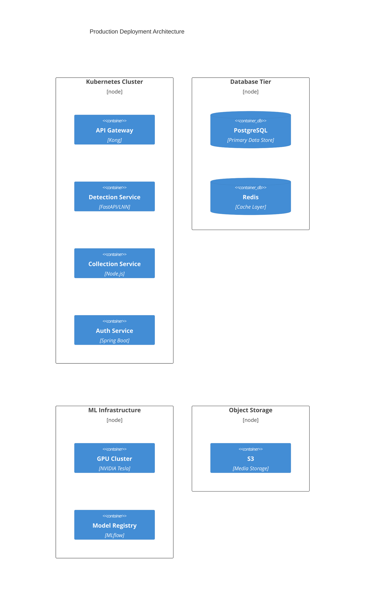

# Wildlife Detection Safari Pokédex - Deployment Documentation

## Table of Contents
1. [Infrastructure Overview](#1-infrastructure-overview)
2. [Service Deployment](#2-service-deployment)
3. [ML Infrastructure](#3-ml-infrastructure)
4. [Monitoring and Observability](#4-monitoring-and-observability)
5. [Disaster Recovery](#5-disaster-recovery)

## 1. Infrastructure Overview

### 1.1 Deployment Architecture


### 1.2 Infrastructure Requirements

| Component | Specification | Purpose |
|-----------|--------------|----------|
| GPU Nodes | NVIDIA Tesla V100/T4 | LNN Processing |
| CPU Nodes | c5.2xlarge | API Services |
| Memory | 32GB+ per node | Model Inference |
| Storage | SSD-backed | Fast I/O |
| Network | 10Gbps | Low Latency |

## 2. Service Deployment

### 2.1 Kubernetes Configuration

```yaml
# Detection Service Deployment
apiVersion: apps/v1
kind: Deployment
metadata:
  name: detection-service
spec:
  replicas: 3
  selector:
    matchLabels:
      app: detection-service
  template:
    metadata:
      labels:
        app: detection-service
    spec:
      containers:
      - name: detection-service
        image: wildlife-safari/detection-service:latest
        resources:
          limits:
            nvidia.com/gpu: 1
            memory: "16Gi"
          requests:
            nvidia.com/gpu: 1
            memory: "8Gi"
        env:
        - name: MODEL_PATH
          value: "/models/lnn_model.pt"
        - name: GPU_MEMORY_FRACTION
          value: "0.8"
        volumeMounts:
        - name: model-volume
          mountPath: /models
      volumes:
      - name: model-volume
        persistentVolumeClaim:
          claimName: model-storage
```

### 2.2 Deployment Process

1. **Infrastructure Provisioning**
   ```bash
   # Initialize infrastructure
   terraform init
   terraform plan -out=tfplan
   terraform apply tfplan

   # Configure Kubernetes cluster
   kubectl apply -f kubernetes/
   ```

2. **Service Deployment**
   ```bash
   # Deploy services
   kubectl apply -f deployments/
   kubectl apply -f services/
   kubectl apply -f ingress/

   # Verify deployments
   kubectl get deployments
   kubectl get pods
   ```

3. **Database Migration**
   ```bash
   # Run migrations
   kubectl apply -f jobs/db-migration.yaml
   kubectl wait --for=condition=complete job/db-migration
   ```

## 3. ML Infrastructure

### 3.1 GPU Resource Configuration

```yaml
# GPU Node Pool Configuration
apiVersion: v1
kind: NodePool
metadata:
  name: gpu-pool
spec:
  machineType: n1-standard-8
  accelerators:
  - acceleratorCount: 1
    acceleratorType: nvidia-tesla-t4
  initialNodeCount: 2
  autoscaling:
    minNodeCount: 1
    maxNodeCount: 5
```

### 3.2 Model Deployment Pipeline

1. **Model Preparation**
   ```bash
   # Package model for deployment
   mlflow models build-docker -m models/lnn -n wildlife-detection-model

   # Push to registry
   docker push wildlife-registry/detection-model:latest
   ```

2. **Model Serving**
   ```yaml
   apiVersion: serving.kubeflow.org/v1beta1
   kind: InferenceService
   metadata:
     name: wildlife-detection
   spec:
     predictor:
       minReplicas: 1
       maxReplicas: 5
       tensorflow:
         storageUri: "s3://models/wildlife-detection/"
         resources:
           limits:
             nvidia.com/gpu: 1
   ```

## 4. Monitoring and Observability

### 4.1 Monitoring Stack

```yaml
# Prometheus Configuration
apiVersion: monitoring.coreos.com/v1
kind: ServiceMonitor
metadata:
  name: detection-service
spec:
  selector:
    matchLabels:
      app: detection-service
  endpoints:
  - port: metrics
    interval: 15s
    path: /metrics
```

### 4.2 Logging Configuration

```yaml
# Fluentd Configuration
apiVersion: v1
kind: ConfigMap
metadata:
  name: fluentd-config
data:
  fluent.conf: |
    <match kubernetes.**>
      @type elasticsearch
      host elasticsearch-logging
      port 9200
      logstash_format true
      buffer_chunk_limit 2M
      buffer_queue_limit 32
      flush_interval 5s
      max_retry_wait 30
      disable_retry_limit
      num_threads 8
    </match>
```

## 5. Disaster Recovery

### 5.1 Backup Configuration

```yaml
# Backup CronJob
apiVersion: batch/v1beta1
kind: CronJob
metadata:
  name: db-backup
spec:
  schedule: "0 1 * * *"
  jobTemplate:
    spec:
      template:
        spec:
          containers:
          - name: backup
            image: wildlife-safari/db-backup:latest
            env:
            - name: BACKUP_PATH
              value: "s3://backups/db/"
            - name: RETENTION_DAYS
              value: "30"
```

### 5.2 Recovery Procedures

1. **Database Recovery**
   ```bash
   # Restore from backup
   kubectl apply -f jobs/db-restore.yaml
   kubectl wait --for=condition=complete job/db-restore
   ```

2. **Model Recovery**
   ```bash
   # Restore ML models
   kubectl apply -f jobs/model-restore.yaml
   kubectl wait --for=condition=complete job/model-restore
   ```

### 5.3 High Availability Configuration

```yaml
# Service Anti-Affinity
apiVersion: apps/v1
kind: Deployment
metadata:
  name: detection-service
spec:
  template:
    spec:
      affinity:
        podAntiAffinity:
          requiredDuringSchedulingIgnoredDuringExecution:
          - labelSelector:
              matchExpressions:
              - key: app
                operator: In
                values:
                - detection-service
            topologyKey: "kubernetes.io/hostname"
```